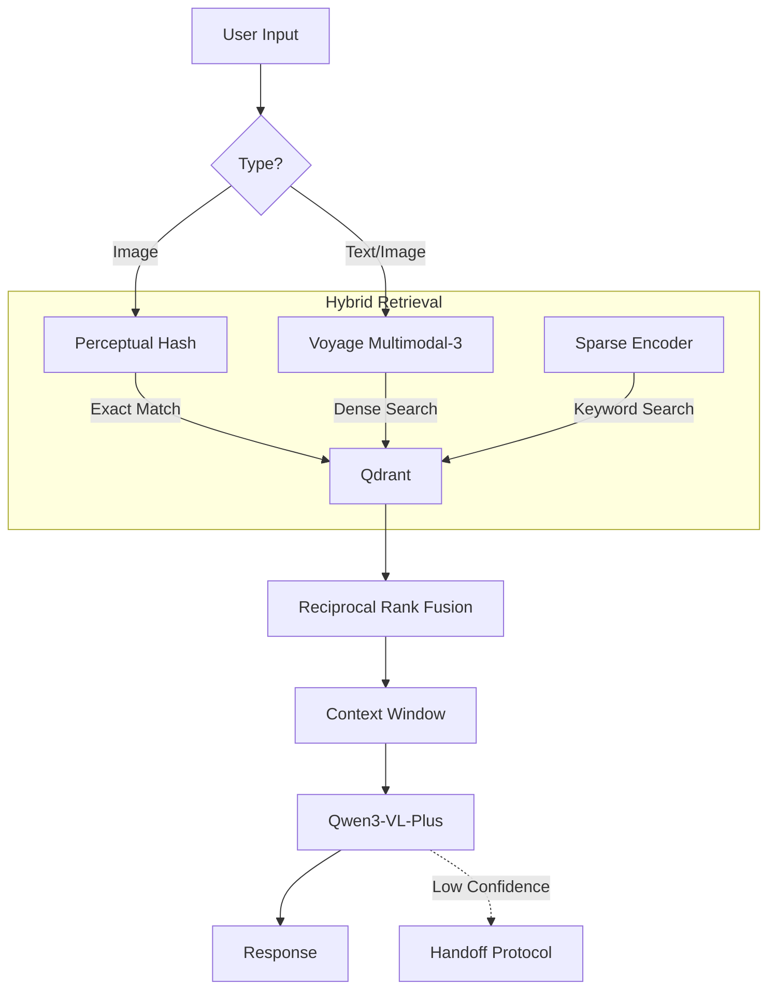

# Multimodal RAG Chatbot (v2)

A production-grade RAG system using **Voyage Multimodal-3** for SOTA embeddings and **Qwen3-VL** for vision-language reasoning. Designed for high accuracy with charts, diagrams, and document screenshots without local GPU requirements.

## ⚡ Key Features

*   **Multimodal Embeddings:** Uses Voyage Multimodal-3 (1024-dim) for unified text-image vector space.
*   **Multi-Vector Storage:** Stores 3 vectors per document (Visual-only, Text-only, Combined) + Sparse (BM25) for robust retrieval.
*   **Hybrid Search:** Reciprocal Rank Fusion (RRF) combines dense, sparse, and perceptual hash results.
*   **Zero-GPU Inference:** Fully API-based architecture (Voyage AI + Alibaba Cloud), runnable on standard CPUs.
*   **Intelligent Escalation:** Detects low confidence, negative sentiment, or explicit requests to trigger human handoff.
*   **Streaming & Async:** Full async pipeline with Server-Sent Events (SSE) for chat streaming.

## 🏗️ Architecture



## 🚀 Quick Start

### 1. Prerequisites
*   Python 3.10+
*   Docker (for Qdrant)
*   API Keys: Voyage AI, Alibaba Cloud (DashScope)

### 2. Installation

```bash
# Clone and setup env
git clone <repo_url>
cd multimodal-rag-chatbot
python -m venv venv
source venv/bin/activate  # Windows: venv\Scripts\activate

# Install lightweight dependencies (No Torch/Transformers required)
pip install -r requirements.txt
```

### 3. Configuration
Create a `.env` file:

```ini
# Required
VOYAGE_API_KEY=voyage-key-here
DASHSCOPE_API_KEY=sk-qwen-key-here

# Optional (Defaults shown)
QDRANT_URL=http://localhost:6333
STORAGE_PROVIDER=local
VERBOSE_USAGE=1
```

### 4. Run

```bash
# Start Vector DB
docker run -d -p 6333:6333 qdrant/qdrant

# Start Server
python server.py
```

Access the **Knowledge Console** at `http://localhost:8000`.

## 🧠 Technical Implementation

### Ingestion Pipeline (`ingestion.py`)
The system employs a **Multi-Vector Strategy** to solve modality asymmetry:
1.  **Image-Dense:** Encodes pure visual features.
2.  **Text-Dense:** Encodes caption and extracted text.
3.  **Combined-Dense:** Fuses visual and textual semantics.
4.  **Sparse:** BM25 vector for keyword precision.
5.  **Fingerprint:** Perceptual hash (pHash/dHash) for exact duplicate detection.

### Retrieval Logic (`retrieval.py`)
Queries are classified into intents (`VISUAL`, `TEXTUAL`, `EXACT`) to weight strategies dynamically:
*   **Text Queries:** Search `text_dense` + `combined_dense` + `sparse`.
*   **Image Queries:** Search `image_dense` + `combined_dense` + `fingerprint`.
*   **Confidence:** Calculated using calibrated cosine similarity thresholds, not raw RRF scores.

### Models Used
| Component | Model | Provider | Cost (Est) |
|-----------|-------|----------|------------|
| **Embedding** | `voyage-multimodal-3` | Voyage AI | $0.12 / 1M tokens |
| **Generation** | `qwen3-vl-plus` | Alibaba Cloud | ~$4.00 / 1M tokens |
| **Captioning** | `qwen3-vl-flash` | Alibaba Cloud | Free (limited) |

## 📡 API Reference

| Endpoint | Method | Payload | Description |
|----------|--------|---------|-------------|
| `/chat` | POST | `{message, conversation_id}` | Text-only chat |
| `/chat/multimodal` | POST | `Multipart Form` | Chat with image upload |
| `/ingest/file` | POST | `Multipart Form` | Ingest PDF/Images (Streaming NDJSON) |
| `/search` | POST | `{query, top_k}` | Debug retrieval results |

## 🛡️ Escalation Logic
The system hands off to human agents (Webhook/Slack) if:
1.  **Explicit Request:** "Talk to human".
2.  **Low Confidence:** Retrieval score < 0.5.
3.  **Negative Sentiment:** User frustration detected (< -0.6).
4.  **Repeated Failures:** 2+ consecutive fallback responses.