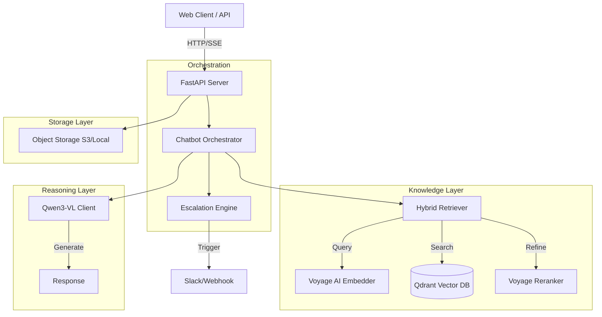
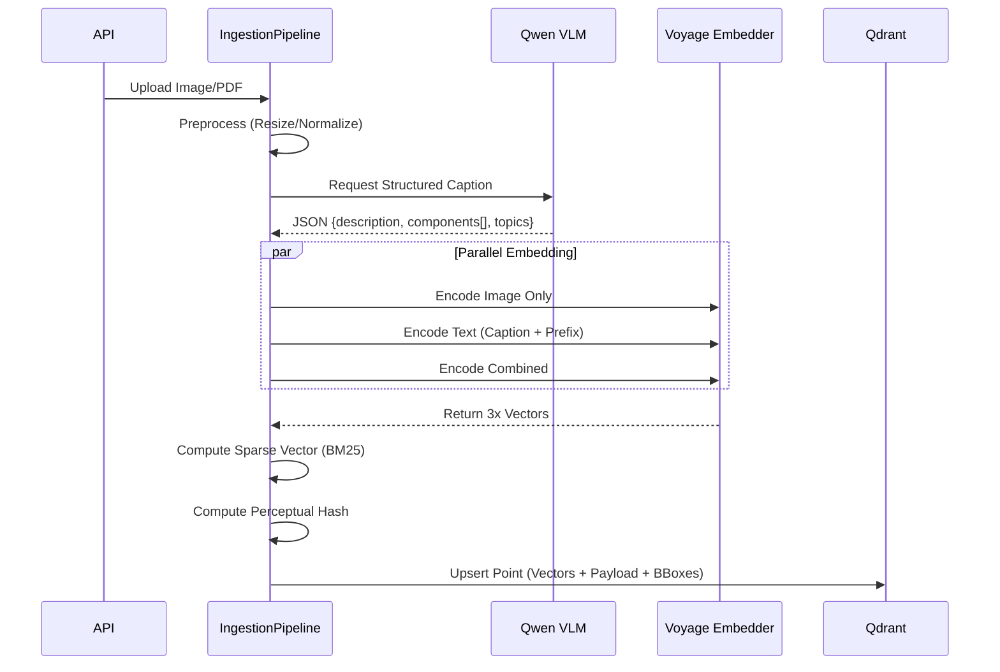
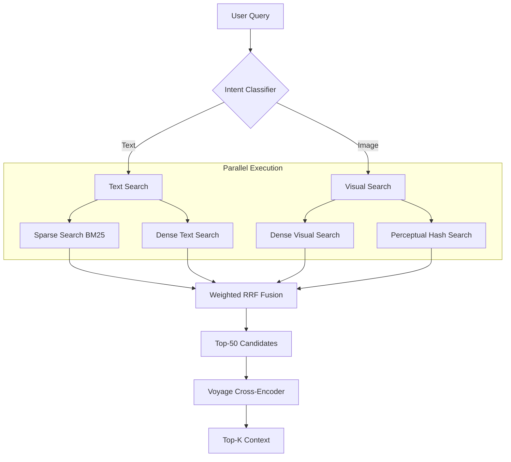

# System Design Document: Multimodal RAG Chatbot (v2)

## 1. Executive Summary
This document details the architecture of a production-grade Multimodal Retrieval-Augmented Generation (RAG) system. The system is designed to ingest, index, and retrieve complex visual documents (technical manuals, schematics, charts) and provide grounded answers using Vision-Language Models (VLMs).

**Key Differentiators:**
*   **Multi-Vector Architecture:** Decouples visual and textual semantic representations.
*   **Hybrid Retrieval:** Combines Dense, Sparse (BM25), and Perceptual Hash search strategies via Reciprocal Rank Fusion (RRF).
*   **Visual Grounding:** Native support for bounding box detection and coordinate mapping for UI highlighting.
*   **Active Escalation:** Deterministic and sentiment-based triggers for human agent handoff.

---

## 2. System Architecture

The system follows a microservices-lite architecture powered by **FastAPI** (AsyncIO), utilizing **Qdrant** for vector storage, **Voyage AI** for multimodal embeddings, and **Alibaba Qwen** for reasoning.

### 2.1 High-Level Data Flow



---

## 3. Ingestion Subsystem

The ingestion pipeline transforms raw files (PDF, Images) into a multi-vector representation optimized for asymmetric retrieval (Image-to-Text, Text-to-Image).

### 3.1 Multi-Vector Strategy
Unlike standard RAG which stores one vector per document, this system stores **three dense vectors** and **one sparse vector** per asset to maximize retrieval surface area.

| Vector Name | Model | Dimension | Purpose |
| :--- | :--- | :--- | :--- |
| `image_dense` | Voyage Multimodal-3 | 1024 | Pure visual similarity search. |
| `text_dense` | Voyage Multimodal-3 | 1024 | Semantic search on captions/OCR. |
| `combined_dense` | Voyage Multimodal-3 | 1024 | Fused multimodal representation. |
| `sparse` | Custom BM25 | Dynamic | Keyword/Part-number exact matching. |

### 3.2 Contextual Enrichment & Grounding
Before embedding, images undergo **Structured Captioning** via `Qwen3-VL-Flash`.
1.  **Component Detection:** Extracts bounding boxes (`bbox_2d`) for key elements (valves, buttons).
2.  **Contextual Prefixing:** Prepends metadata (Source, Page, Type) to the text chunk to resolve ambiguity (Anthropic Contextual Retrieval technique).
3.  **Perceptual Hashing:** Computes pHash/dHash for O(1) exact duplicate detection.

### 3.3 Ingestion Flow



---

## 4. Retrieval Subsystem

The retrieval engine employs an **Adaptive Query** strategy. It classifies the user intent to dynamically weight different search strategies.

### 4.1 Query Classification
Incoming queries are classified into intents:
*   `VISUAL_SEARCH`: "What is this?" (Image provided)
*   `TEXTUAL_SEARCH`: "How do I reset the pump?"
*   `EXACT_MATCH`: "Find this specific diagram."

### 4.2 Hybrid Search & Fusion
The system executes parallel searches based on intent. Results are aggregated using **Weighted Reciprocal Rank Fusion (RRF)**.

*   **Visual Query:** Weights `image_dense` (2.0) and `exact_hash` (3.0) higher.
*   **Text Query:** Weights `text_dense` (2.0) and `sparse` (1.5) higher.

### 4.3 Reranking (Precision Layer)
Top-K candidates (default 50) from RRF are passed to a **Cross-Encoder (Voyage Rerank 2)**.
*   **Input:** Query + Document Text (Caption + OCR).
*   **Output:** Re-ordered list based on deep semantic relevance.
*   **Impact:** Filters out "visually similar but semantically irrelevant" results.

### 4.4 Retrieval Flow



---

## 5. Generation & Visual Grounding

The generation layer uses `Qwen3-VL-Plus` to synthesize answers. It is context-aware and capable of **Visual Grounding** (locating elements in images).

### 5.1 Visual Grounding API
The system exposes a dedicated endpoint `/visual-grounding` that resolves natural language queries to image coordinates.
1.  **Check Index:** Looks for pre-computed bounding boxes in Qdrant metadata.
2.  **Real-time Inference:** If not indexed, invokes Qwen3-VL to predict `bbox_2d` on the fly.
3.  **Normalization:** Converts model coordinates (0-1000) to frontend percentages.

### 5.2 Streaming Response
Responses are streamed via Server-Sent Events (SSE) to minimize Time-To-First-Token (TTFT). The stream includes:
1.  Text tokens.
2.  Source citations (Markdown).
3.  Visual grounding metadata (for UI overlays).

---

## 6. Escalation Engine

The system includes a deterministic state machine to handle failures and handoffs.

### 6.1 Triggers
| Trigger Type | Condition | Action |
| :--- | :--- | :--- |
| **Explicit** | User says "talk to human", "agent" | Immediate Handoff |
| **Confidence** | Retrieval Confidence < 0.50 | Soft Escalation Offer |
| **Sentiment** | Sentiment Score < -0.6 | Priority Handoff |
| **Failure** | 2+ Consecutive Low Confidence responses | Handoff |

### 6.2 Confidence Calibration
Confidence is not raw vector similarity. It is a calculated metric:
$$ C = S_{top} + \text{GapBonus}(S_{top} - S_{2nd}) + \text{IntentBonus} + \text{ExactMatchBonus} $$
*   $S_{top}$: Cosine similarity of top result.
*   GapBonus: Rewards distinct answers.

---

## 7. Data Schema (Qdrant)

The vector database schema is designed for flexibility and speed.

**Collection Config:**
```json
{
  "vectors": {
    "image_dense": { "size": 1024, "distance": "Cosine" },
    "text_dense": { "size": 1024, "distance": "Cosine" },
    "combined_dense": { "size": 1024, "distance": "Cosine" }
  },
  "sparse_vectors": {
    "sparse": { "index": { "on_disk": false } }
  }
}
```

**Payload Schema:**
```json
{
  "id": "uuid",
  "type": "image|text|pdf",
  "url": "s3://bucket/path/img.jpg",
  "caption": "Full generated caption...",
  "extracted_text": "OCR text content...",
  "fingerprint": {
    "phash": "binary_string",
    "avg_color": [r, g, b]
  },
  "components": [
    {
      "label": "Pressure Valve",
      "bbox_2d": [100, 200, 150, 250],
      "type": "valve"
    }
  ],
  "metadata": {
    "filename": "manual.pdf",
    "page_number": 12
  }
}
```

---

## 8. Infrastructure & Scalability

*   **Stateless API:** The FastAPI server is stateless; conversation context is stored in memory (for demo) or can be backed by Redis.
*   **Async I/O:** All external calls (Voyage, Qwen, Qdrant, S3) are non-blocking `async/await`.
*   **Rate Limiting:** Client-side semaphores enforce strict rate limits (e.g., 3 RPM for embedding) to manage API costs/quotas.
*   **Storage Abstraction:** `storage.py` provides a unified interface for Local, S3, and OSS, allowing seamless cloud migration.