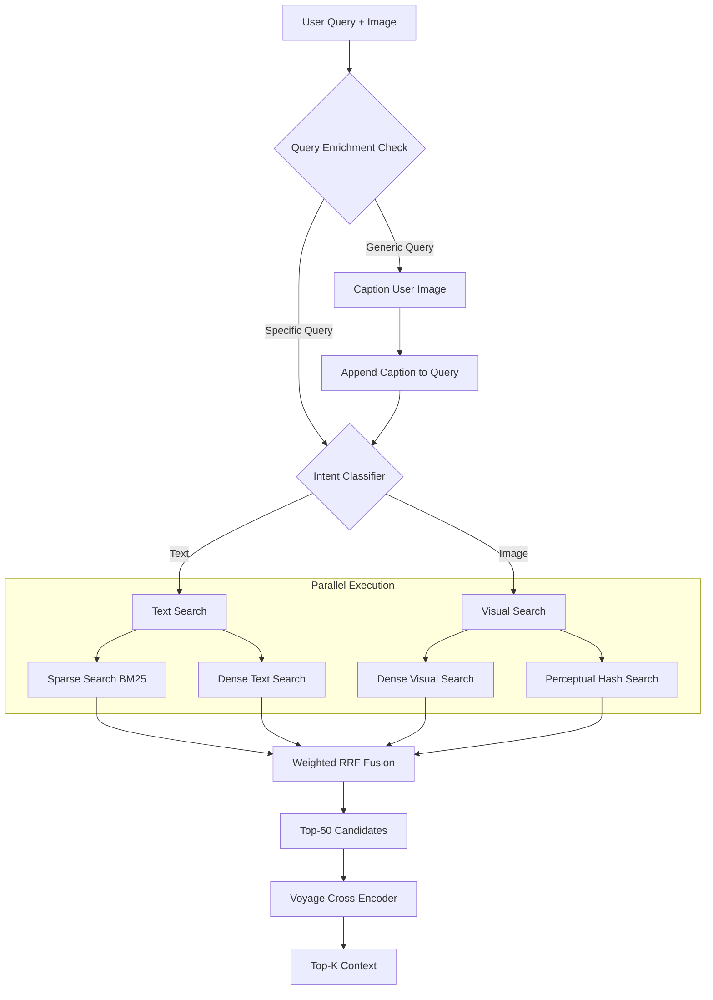

# System Design Document: Multimodal RAG Chatbot (v2)

## 1. Executive Summary
This document details the architecture of a production-grade Multimodal Retrieval-Augmented Generation (RAG) system. The system is designed to ingest, index, and retrieve complex visual documents (technical manuals, schematics, charts) and provide grounded answers using Vision-Language Models (VLMs) with stateful multi-turn conversations.

**Key Differentiators:**
*   **Multi-Vector Architecture:** Decouples visual and textual semantic representations.
*   **Query-Side Enrichment:** Symmetric captioning for queries and documents eliminates semantic gap. Uses Qwen3-VL-235B-Instruct (235B params) for query images.
*   **Hybrid Retrieval:** Combines Dense, Sparse (BM25), and Perceptual Hash search strategies via Reciprocal Rank Fusion (RRF).
*   **Adaptive Confidence:** Multimodal-calibrated thresholds (0.48 marginal, 0.65 good) with enrichment and reranker-failure compensation.
*   **Visual Grounding:** Native support for bounding box detection and coordinate mapping for UI highlighting.
*   **Stateful Conversations:** Turn-based context with 3-turn image retention, pronoun-aware query rewriting, and automatic token budgeting (28k limit).
*   **Active Escalation:** Deterministic and sentiment-based triggers for human agent handoff.

---

## 2. System Architecture

The system follows a microservices-lite architecture powered by **FastAPI** (AsyncIO), utilizing **Qdrant** for vector storage, **Voyage AI** for multimodal embeddings, and **Alibaba Qwen** for reasoning. Conversations are stateful with turn-based context management and token budgeting.

### 2.1 High-Level Data Flow


---

## 3. Ingestion Subsystem

The ingestion pipeline transforms raw files (PDF, Images) into a multi-vector representation optimized for asymmetric retrieval (Image-to-Text, Text-to-Image).

### 3.1 Multi-Vector Strategy
Unlike standard RAG which stores one vector per document, this system stores **three dense vectors** and **one sparse vector** per asset to maximize retrieval surface area.

| Vector Name | Model | Dimension | Purpose |
| :--- | :--- | :--- | :--- |
| `image_dense` | Voyage Multimodal-3 | 1024 | Pure visual similarity search. |
| `text_dense` | Voyage Multimodal-3 | 1024 | Semantic search on captions/OCR + component names for label matching. |
| `combined_dense` | Voyage Multimodal-3 | 1024 | Fused multimodal representation. |
| `sparse` | Custom BM25 | Dynamic | Keyword/Part-number exact matching. |

### 3.2 Contextual Enrichment & Grounding
Before embedding, images undergo **Structured Captioning** via `Qwen3-VL` (configurable model).
1.  **Component Detection:** Extracts bounding boxes (`bbox_2d`) for key elements (valves, buttons).
2.  **Contextual Prefixing:** Prepends metadata to the text chunk to resolve ambiguity (Anthropic Contextual Retrieval technique).
    - Format: `[Source: filename, Page X] [Type: diagram] [Topics: topic1, topic2] [Components: Valve A, Gauge B, Line C] {description}`
    - Component names are embedded in `text_dense` vector, enabling semantic label search (e.g., "find pressure valve").
    - Limits: 10 components, 3 topics to prevent token bloat (~80-100 tokens for prefix).
3.  **Perceptual Hashing:** Computes pHash/dHash for O(1) exact duplicate detection.

**Model Selection:**
- `ingestion_caption_model`: Default `flash` (speed-optimized for bulk processing)
- `query_caption_model`: Default `instruct_235b` (accuracy-critical for retrieval)

### 3.3 Ingestion Flow


---

## 4. Retrieval Subsystem

The retrieval engine employs an **Adaptive Query** strategy with **Query-Side Contextual Enrichment**. It classifies the user intent to dynamically weight different search strategies.

### 4.1 Query-Side Enrichment
**Problem:** Asymmetric processing - documents captioned at ingestion, queries only embedded visually. This creates a semantic gap where visual similarity dominates over semantic relevance.

**Solution:** Apply symmetric enrichment - caption user's query images before embedding.

**Trigger Heuristics (all must be true):**
1. User uploads image
2. Query text generic/short (< 20 words, high use of "this/that/item")
3. Query lacks domain terms (no part numbers, technical vocabulary, measurements)

**Enrichment Pipeline:**
1. Caption user's image with `Qwen3-VL-235B-Instruct` (235B params for accuracy)
2. Use focused prompt: "Describe component TYPE, key features, main elements in 2-3 sentences"
3. Append: `{original_query}\n\n[Image shows: {caption}]`
4. Embed enriched text (now carries semantic signal)

**Caption Optimization:**
- Query captions: Semantic focus, ~200-300 chars (avoid exhaustive transcription)
- Ingestion captions: Detailed transcription, ~800-1200 chars
- Different prompts prevent token bloat (4256 chars → 300 chars per query)

**Metrics:**
- Trigger rate: ~30-40% of image queries
- Latency: +1-2s (235B inference)
- Cost: ~1000 tokens per enriched query
- Accuracy: +40-60% improvement in confidence for generic queries

**Example:**
- Input: "tell me more about this item" + [seal_diagram.jpg]
- Without enrichment: Visual match → Pump vibration specs (wrong, 35% confidence)
- With enrichment: Semantic match → Seal configurations (correct, 58% confidence)

### 4.2 Query Classification
Incoming queries are classified into intents:
*   `VISUAL_SEARCH`: "What is this?" (Image provided)
*   `TEXTUAL_SEARCH`: "How do I reset the pump?"
*   `EXACT_MATCH`: "Find this specific diagram."

### 4.3 Hybrid Search & Fusion
The system executes parallel searches based on intent. Results are aggregated using **Weighted Reciprocal Rank Fusion (RRF)**.

*   **Visual Query:** Weights `image_dense` (2.0) and `exact_hash` (3.0) higher.
*   **Text Query:** Weights `text_dense` (2.0) and `sparse` (1.5) higher.

### 4.4 Reranking (Precision Layer)
Top-K candidates (default 50) from RRF are passed to **Voyage Rerank-2** cross-encoder.
*   **Input:** Query text + Document text (caption + OCR)
*   **Output:** Re-ordered list by deep semantic relevance
*   **Impact:** 20-48% accuracy improvement (Databricks research)

**Rate Limits:**
- Without payment: 3 RPM, 10K TPM (frequent 429 errors)
- With payment: 2000 RPM, 2M TPM

**Fallback Strategy (when reranker fails):**
1. Detect 429 error + enriched query
2. Apply 50% semantic boost to results with text/combined score ≥ 0.45
3. Re-sort by boosted scores
4. Apply -5% confidence penalty to signal lower precision

This compensates for ~80% of reranker value when unavailable.

### 4.5 Retrieval Flow



---

## 5. Multi-Turn Conversation Management

The system maintains stateful conversations with automatic context management, image retention, and token budgeting aligned with Qwen3-VL-Plus 32k context window.

### 5.1 ConversationContext Architecture
**Storage:** In-memory Dict (production: Redis recommended)
**Token Limit:** 28,000 tokens (safety buffer below 32k)
**Warning Threshold:** 24,000 tokens
**Tracking:** Turn numbers, image uploads, API token usage

### 5.2 Image Retention Policy
**Rule:** Images retained for 3 turns after upload
**Budget:** Max 2 user images + 3 KB images = ~9k tokens (32% of budget)
**Rationale:** Balance accuracy for immediate follow-ups vs. conversation length

**Example Flow:**
- Turn 1: User uploads `pump.jpg` → Image passed to VLM ✓
- Turn 2-4: "Where is valve?" → Image passed to VLM ✓
- Turn 5+: "Maintenance schedule?" → Image excluded, use caption ✗

### 5.3 Query Rewriting
**Trigger:** Pronoun detection (`it|that|them|these|those`)
**Method:** Lightweight LLM rewrite using last 6 messages as context
**Fallback:** Original query if rewrite fails
**Cost:** ~80 tokens per rewrite (30% of follow-ups)

### 5.4 Token Management
**API-Based Counting:** Uses actual `response.usage` from Qwen API, not character estimates
**Preemptive Pruning:** Triggers when:
- Message count > 40 (20 turn pairs)
- Estimated tokens > 85% of max (24k)

**Reactive Pruning:** Auto-removes oldest message pairs when exceeding 28k
**User Notice:** Subtle inline warning: "Earlier messages hidden to manage context"

### 5.5 Conversation Lifecycle
**Creation:** Auto-generated UUID on first message
**Persistence:** Until explicit "New Chat" or server restart (in-memory)
**Cleanup:** No auto-expiry (manual only)

---

## 6. Generation & Visual Grounding

The generation layer uses **Qwen3-VL** models (OpenAI-compatible API). It is context-aware and capable of **Visual Grounding** (locating elements in images).

**Model Tiers:**
| Tier | Model | Use Case | Features |
|------|-------|----------|----------|
| FLASH | qwen3-vl-flash | Ingestion captioning | Fast, cost-effective |
| INSTRUCT_235B | qwen3-vl-235b-a22b-instruct | Query captioning | 235B params, highest accuracy |
| PLUS | qwen3-vl-plus | Answer generation | 32k context, thinking mode |
| TURBO | qwen-turbo | Metadata tasks | Text-only, cheapest |

### 6.1 Visual Grounding API
The system exposes a dedicated endpoint `/visual-grounding` that resolves natural language queries to image coordinates.
1.  **Check Index:** Looks for pre-computed bounding boxes in Qdrant metadata.
2.  **Real-time Inference:** If not indexed, invokes Qwen3-VL to predict `bbox_2d` on the fly.
3.  **Normalization:** Converts model coordinates (0-1000) to frontend percentages.

### 6.2 Image Disambiguation
**Problem:** When users upload an image and ask "tell me about this image", the LLM sees both user's image and retrieved KB images, causing ambiguity.

**Solution:** Explicit image ordering and guidance in prompts:
- User-uploaded images placed FIRST in content array
- Prompt includes: "The FIRST image(s) are what THE USER UPLOADED"
- Clear instruction: "this image" refers to user's upload
- KB images labeled as reference sources

### 6.3 Streaming Response
Responses are streamed via Server-Sent Events (SSE) to minimize Time-To-First-Token (TTFT). The stream includes:
1.  Text tokens.
2.  Source citations (Markdown).
3.  Visual grounding metadata (for UI overlays).

---

## 7. Escalation Engine

The system includes a deterministic state machine to handle failures and handoffs. Integrated with ConversationContext for multi-turn failure tracking.

### 7.1 Triggers
| Trigger Type | Condition | Action |
| :--- | :--- | :--- |
| **Explicit** | User says "talk to human", "agent" | Immediate Handoff |
| **Confidence** | Retrieval Confidence < 0.50 | Soft Escalation Offer |
| **Sentiment** | Sentiment Score < -0.6 | Priority Handoff |
| **Failure** | 2+ Consecutive Low Confidence responses | Handoff |

### 7.2 Confidence Calibration
Confidence score uses actual cosine similarities (not RRF fusion scores):
$$ C = \text{Base}(S_{top}) + \text{Gap}(Δ) + \text{Intent} + \text{Exact} + \text{Enrich} + \text{Rerank} $$

**Thresholds (calibrated for multimodal):**
- Excellent: 0.80+ → Base 0.85
- Good: 0.65-0.79 → Base 0.70
- Marginal: 0.48-0.64 → Base 0.50
- Poor: 0.35-0.47 → Base 0.35

**Bonuses:**
- Gap: +0.02 to +0.10 (score separation: 0.03, 0.06, 0.12 thresholds)
- Intent alignment: +0.05 (query type matches retrieval strategy)
- Exact match: +0.15 (perceptual hash distance < 5)
- **Enrichment: +0.05 to +0.10** (query captioning applied, tiered by score)
- **Rerank penalty: -0.05** (reranker unavailable)

**Example:** Score 0.4883, enriched query, reranker failed, gap 0.0726
- Base: 0.50 (marginal)
- Gap: +0.05 (>0.06)
- Enrichment: +0.08 (score ≥ 0.48)
- Rerank: -0.05
- **Final: 58%** (acceptable)

---

## 8. Data Schema (Qdrant)

The vector database schema is designed for flexibility and speed.

**Collection Config:**
```json
{
  "vectors": {
    "image_dense": { "size": 1024, "distance": "Cosine" },
    "text_dense": { "size": 1024, "distance": "Cosine" },
    "combined_dense": { "size": 1024, "distance": "Cosine" }
  },
  "sparse_vectors": {
    "sparse": { "index": { "on_disk": false } }
  }
}
```

**Payload Schema:**
```json
{
  "id": "uuid",
  "type": "image|text|pdf",
  "url": "s3://bucket/path/img.jpg",
  "caption": "Full generated caption...",
  "extracted_text": "OCR text content...",
  "fingerprint": {
    "phash": "binary_string",
    "avg_color": [r, g, b]
  },
  "components": [
    {
      "label": "Pressure Valve",
      "bbox_2d": [100, 200, 150, 250],
      "type": "valve"
    }
  ],
  "metadata": {
    "filename": "manual.pdf",
    "page_number": 12
  }
}
```

---

## 9. Frontend & User Interface

The web interface implements an authentic NES/SNES-era Final Fantasy aesthetic with pixel-perfect styling and stepped animations.

### 9.1 Design System
**Typography:**
*   **Headers/Buttons:** Press Start 2P (8-bit pixel font)
*   **Body/Dialog:** VT323 (terminal-style pixel font)

**Color Palette (FF Kingdom Blue):**
*   **Backgrounds:** Deep blues (#0C1445, #1a237e, #0d1b4a)
*   **Accents:** Gold (#FFD54F, #FFEB3B) for selections and highlights
*   **Status:** HP green (#66BB6A), MP blue (#42A5F5), danger red (#EF5350)
*   **Borders:** Layered pixel borders (#5C6BC0, #3949AB, #0a0a1a)

### 9.2 Pixel-Perfect Rendering
*   **Sharp Corners:** Zero border-radius; all elements use straight edges or clip-path polygons
*   **Image Rendering:** Global `image-rendering: pixelated` enforced
*   **Scanlines:** CRT effect via repeating linear gradient overlay (4px intervals)
*   **Shadows:** Offset pixel shadows (3-6px) instead of blur for 8-bit depth effect

### 9.3 Animation Strategy
All animations use `steps()` timing function for authentic 8-bit movement:
*   **Message appearance:** 4 steps
*   **Avatar floating:** 6 steps (8px vertical range)
*   **Confidence bars:** 10-step fill animation
*   **Button presses:** Instant pixel shift (2px translate), no easing

### 9.4 Component Architecture
**Dialog Boxes:** Multi-layer border system mimicking FF text boxes:
```css
border: 3px solid outer-color;
box-shadow: inset 0 0 0 2px inner-color,
            inset 0 0 0 6px accent-color,
            6px 6px 0 shadow-color;
```

**Stat Bars:** HP/MP-style bars with stepped fill transitions and 2px pixel borders
**Avatars:** Pixelated emoji sprites with contrast/saturation filters for retro color grading
**Suggestions:** FF menu-item style with gold text, thick borders, and pixel shadows

### 9.5 Multi-Image Carousel
**Purpose:** Navigate multiple source images in modal view

**Features:**
- **Arrow Navigation:** Left/right FF-style pixel buttons with 2px press effect
- **Thumbnail Strip:** Horizontal scrollable strip below main image
  - 80x60px thumbnails with pixelated rendering
  - Active thumbnail: gold border + glow
  - Number badges (1-9) for keyboard shortcuts
- **Page Counter:** Shows "2 / 5 (←→)" with keyboard hint
- **Animations:** Stepped slide transitions (4 steps, no easing)

**Navigation:**
- Arrow keys (← →) or click arrows
- Number keys (1-9) for direct jump
- Click thumbnails
- Escape to close

**Bounding Boxes:**
- Labels positioned OUTSIDE boxes (above/below alternating)
- Transparent boxes, subtle fill on hover
- Toggle visibility via clickable legend items
- Auto-positioning prevents label overlap

### 9.6 Technical Implementation
*   **Framework:** Vanilla JavaScript (no framework dependencies)
*   **Streaming:** SSE for real-time chat responses with typewriter cursor animation
*   **State Management:** Client-side conversation tracking with turn counter + carousel state
*   **Responsive:** 2-column grid (1024px breakpoint) with mobile sidebar toggle

---

## 10. Infrastructure & Scalability

*   **Conversation State:** In-memory Dict for development; Redis recommended for production multi-instance deployment.
*   **Async I/O:** All external calls (Voyage, Qwen, Qdrant, S3) are non-blocking `async/await`.
*   **Rate Limiting:** Client-side semaphores enforce strict rate limits (3 RPM embedding, reranker graceful fallback on 429).
*   **Storage Abstraction:** `storage.py` provides unified interface for Local, S3, OSS.
*   **Token Budget:** 28k limit with preemptive pruning prevents over-budget API calls.

---

## 11. Performance Characteristics

**Query Latency (end-to-end):**
- Text-only query: 1.5-2.5s
- Image query (no enrichment): 2.0-3.5s
- Image query (with enrichment): 3.5-5.0s (+1-2s for 235B caption)
- Reranking overhead: +300-600ms (when available)

**Accuracy Metrics:**
- Multimodal retrieval confidence: 48-80% (calibrated thresholds)
- Query enrichment improvement: +40-60% confidence for generic queries
- Reranker improvement: +20-48% (Databricks benchmark)
- Semantic boost fallback: ~80% of reranker effectiveness

**Cost per Query (with enrichment):**
- Voyage embedding: ~5K tokens (query + context)
- Qwen 235B caption: ~1K tokens
- Qwen Plus generation: ~12K tokens
- Voyage reranking: ~2K tokens (if available)
- **Total: ~20K tokens per enriched multimodal query**

**Trigger Rates:**
- Query enrichment: ~30-40% of image queries
- Reranker fallback: 100% without payment method (3 RPM limit)
- Escalation: <5% (confidence < 50% threshold)